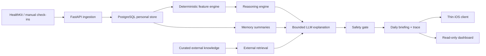

# Baseline

Baseline is a private physiological decision-support system. It ingests Apple
Health and manual lifestyle data, computes deterministic recovery/training
features, retrieves structured evidence, and produces evidence-backed daily
briefings.

It is an AI engineering portfolio project, not an AI fitness coach and not a
medical tool. The product boundary is wellness decision support: Baseline can
explain training, recovery, sleep, and goal tradeoffs, but it must not diagnose,
treat, prescribe dosing, or override clinician guidance.

## What A Reviewer Should Notice

- Personal data uses PostgreSQL and deterministic SQL/time-window retrieval.
- RAG is reserved for curated external knowledge, not raw personal time-series
  data.
- Metrics and readiness are computed by versioned code before any LLM call.
- User-facing recommendations carry evidence, confidence, uncertainty, and
  safety status.
- The LLM layer explains bounded structured inputs; it does not compute health
  metrics or bypass safety validation.
- Demo and evaluation paths use synthetic fixtures only.

## System Shape



The main API package is `apps/api/baseline_api`. The app factory is
`baseline_api.app:create_app`, the ASGI entry point is `baseline_api.main:app`,
and runtime settings are loaded from environment variables in
`baseline_api.config.Settings`.

## Why SQL For Personal Data And RAG For External Knowledge

Apple Health and check-in records are structured, time-bounded, user-owned
facts. The system needs exact windows, provenance, deletion, consent, audit
events, and reproducible feature formulas. SQL is the right default for that
surface because it can answer questions like "which normalized samples
contributed to today's sleep debt?" without lossy embedding recall.

External exercise, recovery, and safety references are different. They are
public or curated documents where semantic retrieval and citation binding are
useful. Baseline therefore keeps external knowledge in `knowledge_source` and
`knowledge_chunk` records and exposes it through `packages/knowledge` plus
`baseline_api.retrieval`. External citations stay separate from personal
evidence in the briefing contract.

## Deterministic Before LLM

The LLM never receives raw HealthKit dumps and never calculates readiness.
Before generation:

1. `baseline_api.ingestion` normalizes source samples.
2. `baseline_api.features` computes versioned daily feature bundles.
3. `baseline_api.reasoning` produces readiness state, risk flags, candidate
   options, evidence, confidence, uncertainty, and trace metadata.
4. `baseline_api.llm` generates a bounded explanation from structured inputs.
5. `baseline_api.safety` validates generated text as a hard post-generation
   gate.

If a stage degrades, the trace and response disclose the limitation instead of
fabricating missing data.

## Repository Map

| Path | Purpose |
| --- | --- |
| `apps/api/baseline_api` | FastAPI app, database models/repositories, feature engine, reasoning, LLM orchestration, safety, privacy, retrieval, briefing, observability, schemas, check-in, feedback, assistant, and goals. |
| `apps/ios` | Thin SwiftUI client for onboarding, privacy mode, HealthKit sync, check-ins, goals, briefings, and trace presentation. |
| `apps/dashboard` | Dependency-free internal dashboard with synthetic demo mode and host-gated read-only operator mode. |
| `packages/fixtures` | Deterministic synthetic personas, golden scenarios, and HealthKit-like sync payloads. |
| `packages/eval` | Offline eval registry, scorers, reports, safety/privacy suites, and demo leak checks. |
| `packages/knowledge` | Curated external corpus models, chunking, ingestion, embeddings abstraction, and in-memory store. |
| `docs/architecture` | System overview, data model, API contracts, evaluation, observability, synthetic data, and model routing. |
| `docs/privacy` | Data classification, minimization, consent, deletion/export, and LLM disclosure boundaries. |
| `docs/safety` | Wellness-only safety boundary, confidence policy, refusal categories, and failure modes. |

## Local Setup

```bash
cp .env.example .env
docker compose -f infra/docker-compose.yml up -d
uv run uvicorn baseline_api.main:app --reload
python -m arq baseline_api.worker.WorkerSettings
```

Then open `http://127.0.0.1:8000/health`. It should return HTTP 200.
Set `BASELINE_API_AUTH_TOKEN` for any non-local deployment and pass the same
token to the iOS client through `BASELINE_API_AUTH_TOKEN` or the
`BaselineAPIAuthToken` Info.plist key.

Useful checks:

```bash
make lint
make typecheck
make test
make eval
make docs-check
```

`make test` uses Postgres integration tests when the configured database is
reachable. In restricted sandboxes where local TCP to Postgres is blocked,
DB-marked tests are skipped and the coverage threshold is relaxed for that run.
To require database coverage:

```bash
BASELINE_REQUIRE_TEST_DB=1 make test
uv run pytest --require-db
```

## Demo Walkthrough

The public demo path is deterministic and synthetic. It uses the 60-day demo
persona plus scenario variants from `packages/fixtures`; it does not require
Apple Health, secrets, a live model provider, or private user data.

```bash
make demo
npm test --prefix apps/dashboard
```

## Portfolio Documentation

- [Architecture overview](docs/architecture/system-overview.md)
- [Data model](docs/architecture/data-model.md)
- [API contracts](docs/architecture/api-contracts.md)
- [Model routing](docs/architecture/model-routing.md)
- [Evaluation report](docs/architecture/evaluation.md)
- [Privacy notes](docs/privacy/README.md)
- [Safety boundary](docs/safety/README.md)
- [Failure modes](docs/safety/failure-modes.md)
- [Deployment readiness](docs/runbooks/deployment-readiness.md)
