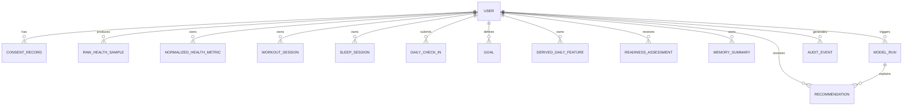

# Data Model

Baseline stores all physiological data in **PostgreSQL 16** with a strict separation
between raw source data, normalized records, derived features, generated outputs,
and evaluation traces. This document describes the schema implemented in
`apps/api/baseline_api/db/models/` and migrated by Alembic.

## Layer Separation

| Layer | Tables | Purpose |
|-------|--------|---------|
| **Identity & Consent** | `user`, `consent_record` | Account identity and recorded consent choices. |
| **Raw Source Data** | `raw_health_sample` | Untouched samples imported from Apple Health or other sources. |
| **Normalized Records** | `normalized_health_metric`, `workout_session`, `sleep_session` | Canonical, unit-normalized metrics and sessions. |
| **Manual Input** | `daily_check_in`, `goal` | User-submitted subjective context and active goals. |
| **Derived Features** | `derived_daily_feature` | Deterministic, versioned feature bundles per day. |
| **Generated Outputs** | `readiness_assessment`, `recommendation`, `memory_summary`, `model_run` | Reasoning artifacts, user-facing recommendations, compressed memory, and LLM traces. |
| **External Knowledge** | `knowledge_source` | Curated, citable reference corpus. |
| **Evaluation & Audit** | `evaluation_case`, `audit_event` | Golden/eval scenarios and redacted audit trail. |

## Entity-Relationship Diagram

## Tables

### `user`
A single Baseline account.

| Column | Type | Notes |
|--------|------|-------|
| `id` | UUID | PK |
| `timezone` | string | Default `UTC` |
| `locale` | string | Default `en` |
| `privacy_mode` | `PrivacyMode` enum | `local_only`, `cloud_assisted`, `hybrid` |
| `active_consent_version` | string | Version of the latest active consent |
| `created_at`, `updated_at` | datetime | Auto-set on creation |

**Data classification:** Restricted (identifiable account data).

### `consent_record`
Snapshot of consent choices at a point in time.

| Column | Type | Notes |
|--------|------|-------|
| `id` | UUID | PK |
| `user_id` | UUID | FK → `user.id` |
| `consent_version` | string | |
| `health_categories_enabled` | JSONB | List of enabled HealthKit categories |
| `cloud_processing_enabled` | bool | |
| `external_llm_enabled` | bool | |
| `raw_note_processing_enabled` | bool | |
| `timestamp` | datetime | When consent was recorded |
| `revoked_at` | datetime | Nullable |

**Data classification:** Restricted (records sensitive health-data consent).

### `raw_health_sample`
Single raw sample imported from a source platform.

| Column | Type | Notes |
|--------|------|-------|
| `id` | UUID | PK |
| `user_id` | UUID | FK → `user.id` |
| `source_platform` | string | e.g. `Apple Health` |
| `source_device` | string | Nullable |
| `source_sample_id` | string | Platform-provided sample idempotency key |
| `sample_type` | `MetricType` enum | |
| `start_time`, `end_time` | datetime | |
| `raw_value` | float | |
| `raw_unit` | string | |
| `source_metadata` | JSONB | Extra platform-specific metadata |
| `imported_at` | datetime | |
| `import_batch_id` | UUID | Import batch provenance |

**Data classification:** Restricted (raw HealthKit samples).

### `normalized_health_metric`
Canonical metric produced from one or more raw samples.

| Column | Type | Notes |
|--------|------|-------|
| `id` | UUID | PK |
| `user_id` | UUID | FK → `user.id` |
| `metric_type` | `MetricType` enum | |
| `start_time`, `end_time` | datetime | |
| `value` | float | Normalized value |
| `unit` | string | Normalized unit |
| `confidence` | float | 0–1 |
| `source_sample_ids` | JSONB | UUID strings of contributing raw samples |
| `normalization_version` | string | Formula/schema version |

**Data classification:** Confidential.

### `workout_session`
Single exercise/workout session.

| Column | Type | Notes |
|--------|------|-------|
| `id` | UUID | PK |
| `user_id` | UUID | FK → `user.id` |
| `start_time`, `end_time` | datetime | |
| `modality` | `Modality` enum | e.g. `run`, `strength`, `kettlebell` |
| `distance` | float | Nullable |
| `duration` | float | Seconds |
| `active_energy` | float | Nullable |
| `average_hr`, `max_hr` | float | Nullable |
| `intensity_zone_distribution` | JSONB | Seconds per zone |
| `perceived_exertion` | int | 1–10, nullable |
| `muscle_group_tags` | JSONB | List of tags |
| `source_sample_ids` | JSONB | UUID strings of contributing raw samples |

**Data classification:** Confidential.

### `sleep_session`
Single sleep session.

| Column | Type | Notes |
|--------|------|-------|
| `id` | UUID | PK |
| `user_id` | UUID | FK → `user.id` |
| `start_time`, `end_time` | datetime | |
| `duration` | float | Seconds |
| `sleep_stage_breakdown` | JSONB | Seconds per stage |
| `interruptions` | int | Nullable |
| `quality_proxy` | float | 0–1, nullable |
| `source_sample_ids` | JSONB | UUID strings of contributing raw samples |

**Data classification:** Confidential.

### `daily_check_in`
User-submitted morning/lifestyle check-in.

| Column | Type | Notes |
|--------|------|-------|
| `id` | UUID | PK |
| `user_id` | UUID | FK → `user.id` |
| `date` | date | |
| `energy_score`, `mood_score`, `soreness_score`, `stress_score`, `perceived_recovery_score`, `food_quality_score` | int | 1–10, nullable |
| `alcohol_flag`, `illness_flag`, `injury_flag`, `travel_flag` | bool | |
| `caffeine_notes` | string | Nullable |
| `sensitive_note_policy` | `SensitiveNotePolicy` enum | |
| `structured_notes` | JSONB | |
| `free_text_note_reference` | string | Reference to redacted/sensitive note store |

**Data classification:** Restricted (manual check-ins and note references).

### `goal`
Active or paused user goal used by the reasoning engine.

| Column | Type | Notes |
|--------|------|-------|
| `id` | UUID | PK |
| `user_id` | UUID | FK → `user.id` |
| `category` | `GoalCategory` enum | e.g. `vo2_max`, `strength`, `sleep` |
| `priority` | int | ≥1 |
| `time_horizon` | `TimeHorizon` enum | |
| `success_metric` | string | |
| `constraints` | JSONB | |
| `active` | bool | |
| `paused_at` | datetime | Nullable |

**Data classification:** Confidential.

### `derived_daily_feature`
Versioned, deterministic feature bundle for a single calendar day.

| Column | Type | Notes |
|--------|------|-------|
| `id` | UUID | PK |
| `user_id` | UUID | FK → `user.id` |
| `date` | date | |
| `feature_version` | string | |
| `sleep_features`, `hrv_features`, `rhr_features`, `training_load_features`, `recovery_features`, `goal_features`, `data_quality` | JSONB | |
| `anomaly_flags` | JSONB | List of flag strings |
| `computed_at` | datetime | |
| `source_sample_ids` | JSONB | UUID strings of contributing raw/normalized records |

**Data classification:** Confidential.

### `readiness_assessment`
Structured readiness assessment from the deterministic reasoning engine.

| Column | Type | Notes |
|--------|------|-------|
| `id` | UUID | PK |
| `user_id` | UUID | FK → `user.id` |
| `date` | date | |
| `assessment_version` | string | |
| `readiness_state` | `ReadinessState` enum | |
| `recommendation_band` | `RecommendationBand` enum | |
| `confidence` | `ConfidenceLevel` enum | |
| `uncertainty` | JSONB | List of strings |
| `evidence_items` | JSONB | List of evidence objects |
| `risk_flags` | JSONB | List of flag strings |
| `goal_tradeoffs` | JSONB | |
| `reasoning_trace_id` | UUID | Traceable reasoning identifier |

**Data classification:** Confidential.

### `recommendation`
User-facing recommendation generated from an assessment and optional LLM run.

| Column | Type | Notes |
|--------|------|-------|
| `id` | UUID | PK |
| `user_id` | UUID | FK → `user.id` |
| `date` | date | |
| `recommendation_type` | `RecommendationType` enum | |
| `recommendation_text` | string | |
| `candidate_options` | JSONB | |
| `evidence_refs` | JSONB | |
| `safety_status` | `SafetyStatus` enum | |
| `model_run_id` | UUID | Nullable FK → `model_run.id` |
| `accepted_action` | JSONB | Nullable |
| `user_feedback` | JSONB | Nullable |

**Data classification:** Restricted (user-facing model output with personal health interpretation).

### `memory_summary`
Compressed summary of a daily, weekly, monthly, or quarterly period.

| Column | Type | Notes |
|--------|------|-------|
| `id` | UUID | PK |
| `user_id` | UUID | FK → `user.id` |
| `period_type` | `PeriodType` enum | |
| `start_date`, `end_date` | date | |
| `summary_version` | string | |
| `observations`, `hypotheses`, `source_refs` | JSONB | |
| `confidence` | float | |
| `sensitive_fields_excluded` | JSONB | List of excluded field names |

**Data classification:** Confidential.

### `model_run`
Traceable external model invocation.

| Column | Type | Notes |
|--------|------|-------|
| `id` | UUID | PK |
| `user_id` | UUID | FK → `user.id` |
| `run_type` | `RunType` enum | |
| `model_provider`, `model_name` | string | |
| `prompt_version`, `schema_version` | string | |
| `input_hash`, `output_hash` | string | Hashes of prompt/output payloads |
| `token_usage` | JSONB | |
| `cost` | float | Nullable |
| `latency_ms` | int | Nullable |
| `safety_result` | JSONB | |

**Data classification:** Confidential (metadata and hashes; no raw prompt payload).

### `knowledge_source`
Curated external reference.

| Column | Type | Notes |
|--------|------|-------|
| `id` | UUID | PK |
| `title` | string | |
| `author_or_org` | string | Nullable |
| `source_type` | `KnowledgeSourceType` enum | |
| `url_or_identifier` | string | Nullable |
| `license_status` | string | Nullable |
| `published_at` | date | Nullable |
| `ingested_at` | datetime | |
| `version` | string | |
| `trust_level` | `TrustLevel` enum | |

**Data classification:** Internal.

### `evaluation_case`
Single evaluated scenario.

| Column | Type | Notes |
|--------|------|-------|
| `id` | UUID | PK |
| `scenario_name` | string | |
| `input_fixture`, `expected_properties`, `actual_output` | JSONB | |
| `pass_fail` | bool | Nullable |
| `failure_reason` | string | Nullable |
| `evaluated_at` | datetime | |

**Data classification:** Confidential when derived from real data; Internal when synthetic (default in test suite).

### `audit_event`
Redacted audit trail.

| Column | Type | Notes |
|--------|------|-------|
| `id` | UUID | PK |
| `user_id` | UUID | Nullable FK → `user.id` |
| `event_type` | `AuditEventType` enum | |
| `actor` | string | |
| `timestamp` | datetime | |
| `event_metadata` | JSONB | Must be redacted |
| `redaction_status` | `RedactionStatus` enum | |

**Data classification:** Internal (after redaction).

## Indexes

All time-series access patterns are indexed on `user_id` plus the relevant time column:

- `raw_health_sample`: `(user_id, start_time)`
- `normalized_health_metric`: `(user_id, start_time)`
- `workout_session`: `(user_id, start_time)`
- `sleep_session`: `(user_id, start_time)`
- `daily_check_in`: `(user_id, date)`
- `derived_daily_feature`: `(user_id, date)`
- `readiness_assessment`: `(user_id, date)`
- `recommendation`: `(user_id, date)`
- `memory_summary`: `(user_id, start_date, end_date)`
- `model_run`: `(user_id, created_at)`
- `audit_event`: `(user_id, timestamp)`
- `consent_record`: `(user_id)`, `(timestamp)`
- `goal`: `(user_id, active)`
- `knowledge_source`: `(trust_level)`
- `evaluation_case`: `(evaluated_at)`
- `user`: `(created_at)`

## Provenance

- `raw_health_sample.import_batch_id` groups samples from a single import batch.
- `normalized_health_metric.source_sample_ids`, `workout_session.source_sample_ids`,
  `sleep_session.source_sample_ids`, and `derived_daily_feature.source_sample_ids`
  store the UUID strings of contributing raw/normalized records as JSONB.
- `recommendation.model_run_id` links to the LLM trace.
- `memory_summary.source_refs` preserves references to source records for auditability.

## Data Classification Summary

Per PRD §20.2:

| Classification | Tables |
|----------------|--------|
| **Restricted** | `user`, `consent_record`, `raw_health_sample`, `daily_check_in`, `recommendation` |
| **Confidential** | `normalized_health_metric`, `workout_session`, `sleep_session`, `goal`, `derived_daily_feature`, `readiness_assessment`, `memory_summary`, `model_run`, `evaluation_case` |
| **Internal** | `knowledge_source`, `audit_event` |
