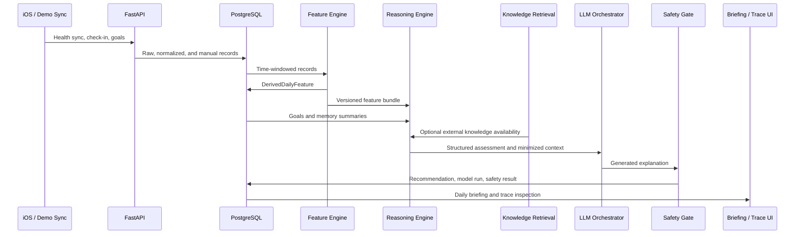

# System Overview

Baseline turns structured personal physiology data into daily training and
recovery decision support. The system is designed so a reviewer can trace each
recommendation backward through deterministic features, personal evidence,
external citations, LLM metadata, and safety validation.

## Runtime Surfaces

| Surface | Location | Responsibility |
| --- | --- | --- |
| API | `apps/api/baseline_api` | FastAPI app, data ingestion, feature computation, reasoning, LLM orchestration, safety, privacy controls, retrieval, briefing persistence, and observability. |
| iOS | `apps/ios` | Thin SwiftUI client for onboarding, privacy mode, HealthKit permissions, sync, daily check-ins, goals, briefing display, and trace UI. |
| Dashboard | `apps/dashboard` | Static operator/demo dashboard for pipeline health, traces, evals, costs, safety events, and synthetic demo scenarios. |
| Fixtures | `packages/fixtures` | Deterministic synthetic personas, golden scenarios, and HealthKit-like sync payloads. |
| Eval | `packages/eval` | Offline suites, scorers, reports, safety/privacy checks, and demo artifact leak checks. |
| Knowledge | `packages/knowledge` | Curated external source models, chunking, ingestion pipeline, embedding abstraction, and vector-store helpers. |

## Request And Data Flow

## Module Responsibilities

| Module | Owns | Does not own |
| --- | --- | --- |
| `baseline_api.ingestion` | Sync payload handling, idempotency, normalization, data-quality metadata, and worker queue boundaries. | Readiness decisions or generated user copy. |
| `baseline_api.features` | Sleep, HRV, resting heart rate, training load, VO2, goal, recovery, and data-quality feature bundles. | LLM prompting or external knowledge claims. |
| `baseline_api.reasoning` | Readiness state, recommendation band, risk flags, hard safety flags, evidence items, goal tradeoffs, uncertainty, and trace IDs. | Prose generation or clinical interpretation. |
| `baseline_api.memory` | Daily/weekly/monthly/quarterly summaries with source refs, confidence, and sensitive-field exclusion. | Raw note retention or medical conclusions. |
| `baseline_api.retrieval` | Curated external knowledge retrieval and citation binding. | Retrieval over raw personal HealthKit records. |
| `baseline_api.llm` | Provider routing, prompt assembly, schema validation, fallback/degraded output, model-run hashes, costs, and latency. | Computing metrics or weakening safety gates. |
| `baseline_api.safety` | Policy-based post-generation verdicts, blocks, rewrites, and escalations. | Feature calculation or data ingestion. |
| `baseline_api.privacy` | Consent, export, deletion, audit events, model disclosures, and data lifecycle controls. | Product recommendations. |
| `baseline_api.observability` | Redacted logs, trace IDs, metrics, cost alerts, and operational metadata. | Raw health-data logging. |
| `baseline_api.briefing` | Daily pipeline orchestration and persisted briefing/trace responses. | New feature formulas beyond the feature engine. |

## API Entry Points

The app factory in `baseline_api.app:create_app` includes these router surfaces:

| Endpoint surface | Purpose |
| --- | --- |
| `GET /health` | Dependency-light service boot check. |
| `GET /v1/health/ping` | Versioned health ping. |
| `POST /v1/health/sync` | Health sync ingestion contract. |
| `POST /v1/checkins/daily` | Create daily check-in. |
| `GET /v1/checkins/daily/by-date/{checkin_date}` | Fetch check-in detail. |
| `POST /v1/goals` and related goal routes | Goal CRUD, pause, and resume. |
| `POST /v1/analysis/daily` | Queue daily briefing analysis. |
| `GET /v1/analysis/daily/{job_id}` | Read analysis job state. |
| `GET /v1/analysis/traces/{trace_id}` | Inspect recommendation trace. |
| `GET /v1/briefings/{date}` | Fetch daily briefing. |
| `POST /v1/assistant/query` | Evidence-bounded assistant Q&A. |
| `POST /v1/data/export` and deletion/consent routes | Data controls. |
| `GET /v1/observability/alerts` and `GET /metrics` | Operator observability. |

## Evidence Boundaries

Personal evidence and external knowledge are intentionally separated all the way
to the response contract:

- Personal evidence is derived from SQL-backed personal records and source
  references.
- External citations come from curated `knowledge_source` and `knowledge_chunk`
  records.
- The recommendation contract exposes both without merging them into a single
  ambiguous evidence list.

This separation is a portfolio talking point and a safety control. It prevents
semantic search over private time-series data from becoming the hidden source of
truth, and it makes deletion/export behavior tractable.
